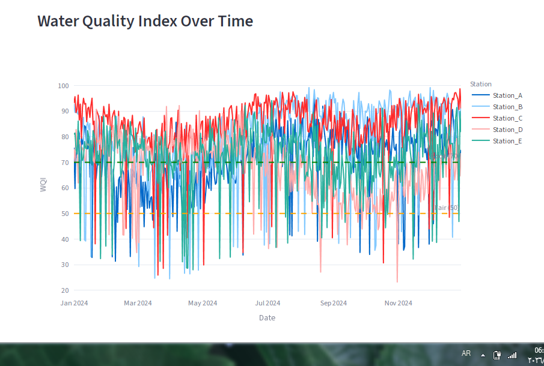
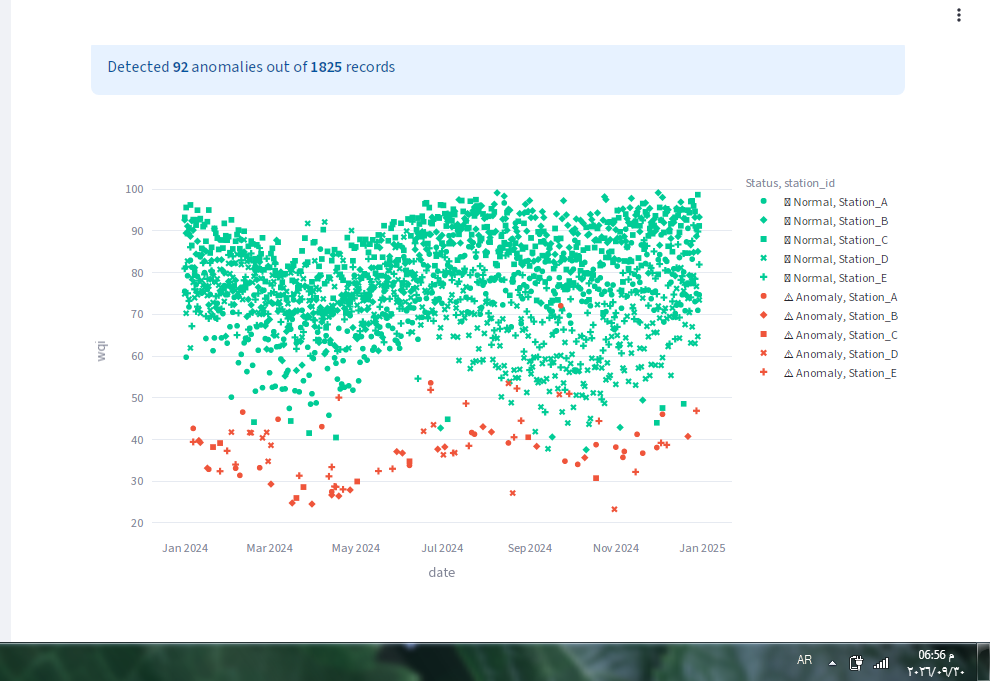
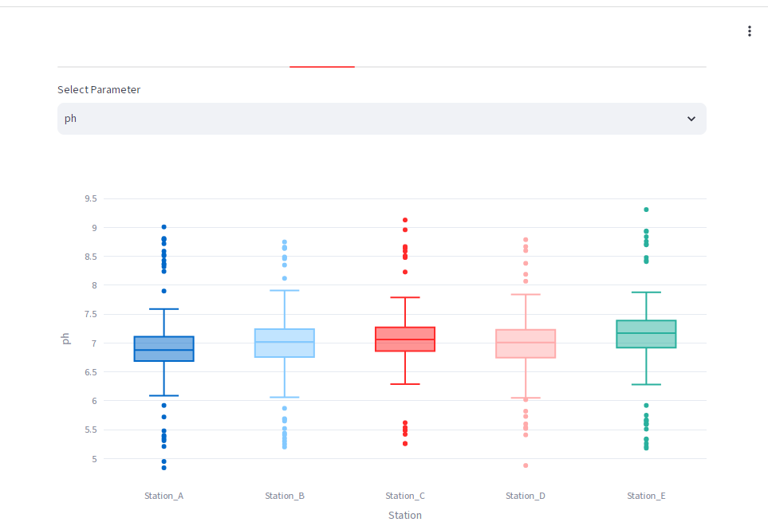
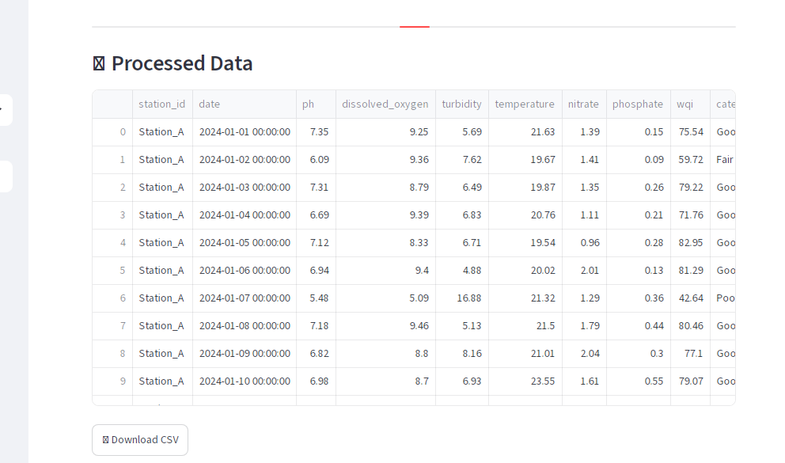
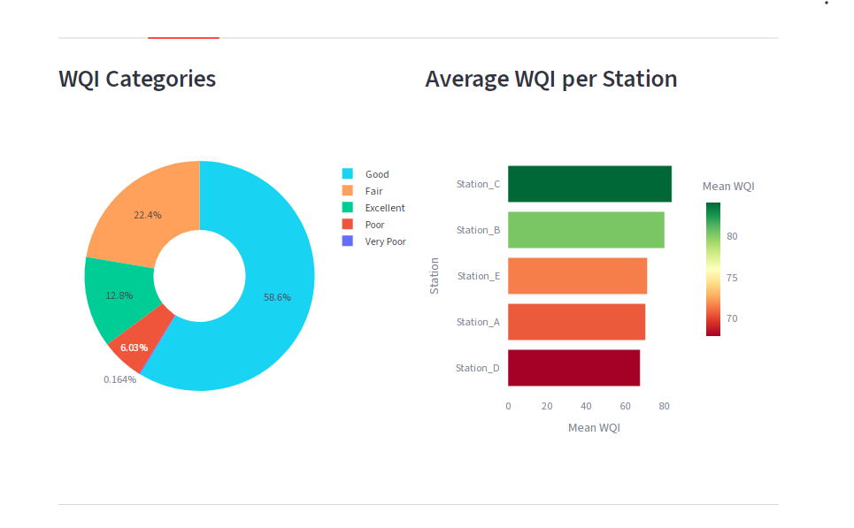

# 🌊 AquaInsight

### AI-Powered Freshwater Quality Monitoring for One Health

**🏆 OneAquaHealth Hackathon 2025 - Data-to-Insight Track**

---

## 🎯 Problem Statement

Freshwater ecosystems face increasing pressure from pollution, climate change, and human activity. Real-time water quality monitoring is critical for protecting both environmental and human health — a core principle of the One Health approach.
## 📸 Dashboard Screenshots

### Time Series Analysis

### WQI Distribution

### Anomaly Detection

### Parameter Analysis

### Data View

Traditional monitoring is slow, expensive, and hard to interpret. **AquaInsight** solves this with AI.

---

## ✨ Features

- 📊 **Water Quality Index (WQI)** — Industry-standard weighted arithmetic method
- 🤖 **Anomaly Detection** — Isolation Forest ML algorithm
- 📈 **Interactive Dashboard** — Streamlit with real-time filtering
- 🚨 **Smart Alerts** — Auto-generated warnings (WQI < 50)
- 📄 **PDF Reports** — Professional analysis reports
- 🔌 **REST API** — FastAPI with Swagger UI
- 🌐 **Multi-Station** — Monitor 5+ stations simultaneously

---

## 🛠️ Tech Stack

- **Data Processing:** pandas, numpy
- **Machine Learning:** scikit-learn
- **Visualization:** Plotly, Matplotlib
- **Dashboard:** Streamlit
- **API:** FastAPI + Uvicorn
- **Reports:** fpdf2

---

## 🚀 Quick Start

1. Install dependencies
2. Generate data
3. Run analysis
4. Launch dashboard
5. Start API

---

## 📊 Results

- **1,825** water quality records
- **5** monitoring stations
- **Mean WQI:** 74.87 (Good)
- **Anomalies Detected:** 92 (5.04%)
- **Active Alerts:** 113

### WQI Distribution
- 🟢 Excellent: 234 (12.8%)
- 🟡 Good: 1,070 (58.6%)
- 🟠 Fair: 408 (22.4%)
- 🔴 Poor: 110 (6.0%)

---

## 🌍 One Health Impact

1. **Environmental Health** → Real-time water monitoring
2. **Human Health** → Early warnings for unsafe water
3. **Policy Support** → Actionable insights for decision-makers

---

## 👨‍💻 Author

**Eng Faris Jamal**

[GitHub](https://github.com/engfarisjamal)

---

**🏆 Built for OneAquaHealth Hackathon 2025 🏆**

*Protecting water, protecting life.*
